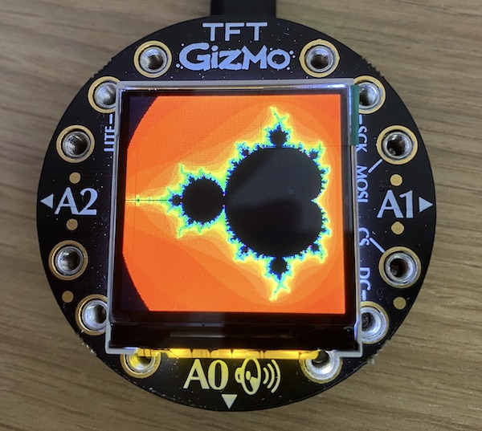
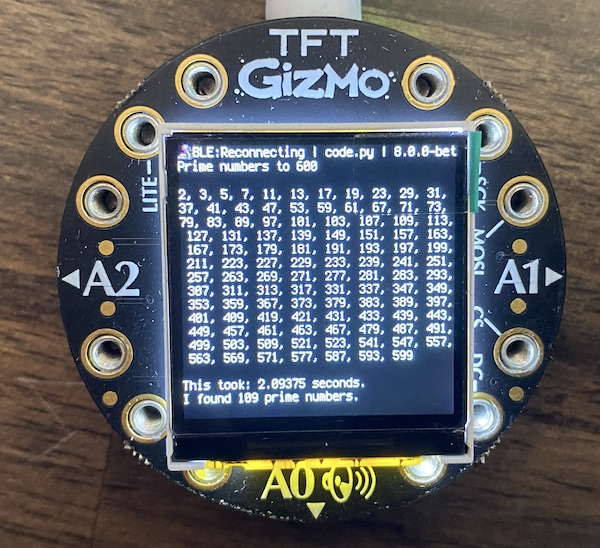

# bluefruit
Collection of programs for the Adafruit Circuitplayground Bluefruit with a TFT-Gizmo attached.

## Mandelbrot



Unfortunately for the [Adafruit Circuitplayground Express](https://learn.adafruit.com/adafruit-circuit-playground-express) with the ATSAMD21 ARM Cortex M0 Processor, running at 3.3V and 48MHz, the RAM of only 32 kB (some 16 available) is not enough for the 240x240 TFT display and a image buffer. And the Circuitpython implementation with this CPU does not support complex numbers, so we can't calculate the nice Mandelbrot fractal on the right.

The [Bluefruit](https://learn.adafruit.com/adafruit-circuit-playground-bluefruit) not just adds bluetooth support, but a beefier CPU: nRF52840 with 64 MHz and 256 kB RAM. It takes 125 seconds to produce the graph on the right with a depth of `ITERATION = 50`.

The code itself is this:

``` py
# mandelbrot on Circuit Playground Bluefruit TFT Gizmo
# https://github.com/kreier/bluefruit/blob/main/apps/mandelbrot.py
# 2022/12/11 v0.3

import board, displayio, random, math, time
from adafruit_gizmo import tft_gizmo

display = tft_gizmo.TFT_Gizmo()

# Create a bitmap with 256 colors
bitmap = displayio.Bitmap(display.width, display.height, 256)

minX = -1.9
maxX = 0.6
width = display.width
height = display.height
aspectRatio = 1
ITERATION = 50
yScale = (maxX-minX)*(float(height)/width)*aspectRatio

def hsv_to_rgb(h, s, v):
    if s == 0.0: v*=255; return (v, v, v)
    i = int(h*6.)
    f = (h*6.)-i; p,q,t = int(255*(v*(1.-s))), int(255*(v*(1.-s*f))), int(255*(v*(1.-s*(1.-f)))); v*=255; i%=6
    if i == 0: ret = (65536*v + 256*t + p)
    if i == 1: ret = (65536*q + 256*v + p)
    if i == 2: ret = (65536*p + 256*v + t)
    if i == 3: ret = (65536*p + 256*q + v)
    if i == 4: ret = (65536*t + 256*p + v)
    if i == 5: ret = (65536*v + 256*p + q)
    #return f"{ret:06X}"
    return ret

# Create a 256 color palette
palette = displayio.Palette(256)
for i in range(256):
    #palette[i] = random.randrange(16777216)
    palette[i] = hsv_to_rgb(i/256, 1, 1)
palette[0] = 0

# Create a TileGrid using the Bitmap and Palette
tile_grid = displayio.TileGrid(bitmap, pixel_shader=palette)

# Create a Group
group = displayio.Group()

# Add the TileGrid to the Group
group.append(tile_grid)

# Add the Group to the Display
display.show(group)

start = time.monotonic()

for y in range(height):
    for x in range(width):
        c = complex(minX+x*(maxX-minX)/width, y*yScale/height-yScale/2)
        z = c
        for iter in range(ITERATION):
            if abs(z) > 2:
                break
            z = z*z+c
        if iter == ITERATION - 1:
            pixelcolor = 0
        else:
            pixelcolor = iter *5
        bitmap[x, y] = pixelcolor
  
end = time.monotonic()
print(f"This took: {(end - start)} seconds.")

# Loop forever so you can enjoy your image
while True:
    pass

```

## Calculating Prime Numbers



Calculations are also much faster. For example the determination of prime numbers is some 5.6 times faster (needing only 2.09 seconds compared to 11.87 seconds). The code is the following:

``` py
import math, time
last = 600
found = 4          # we start from 11, know 2, 3, 5, 7
print(f"Prime numbers to {last}\n")
print('2, 3, 5, 7',end='')
start = time.monotonic()
for number in range(11, last, 2):
    prime = True
    for divider in range(3, int(math.sqrt(number))+1, 2):
        if number % divider == 0:
            prime = False
            break
    if prime:
        print(",", number, end='')
        found += 1
        prime = 1
end = time.monotonic()
print(f"\n\nThis took: {(end - start)} seconds.")
print(f"I found {found} prime numbers.")

while True:
    pass

```

## Menu Selection

This is a future feature. It has been done with our [ssis:bit](https://github.com/ssisbit/ssis.bit) in early 2022. But it still needs adaption for `clue` and `bluefruit`.
